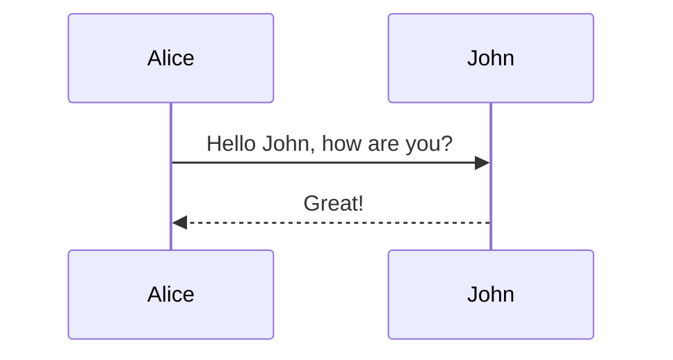

```mermaid
sequenceDiagram
    Alice->>John: Hello John, how are you?
    John-->>Alice: Great!
```





{{< $_hugo_config := `{ "version": 1 }` >}}

     graph LR
      A --- B
      B-->C[fa:fa-ban forbidden]
      B-->D(fa:fa-spinner);

### css

#### 222 

###  啊啊啊

